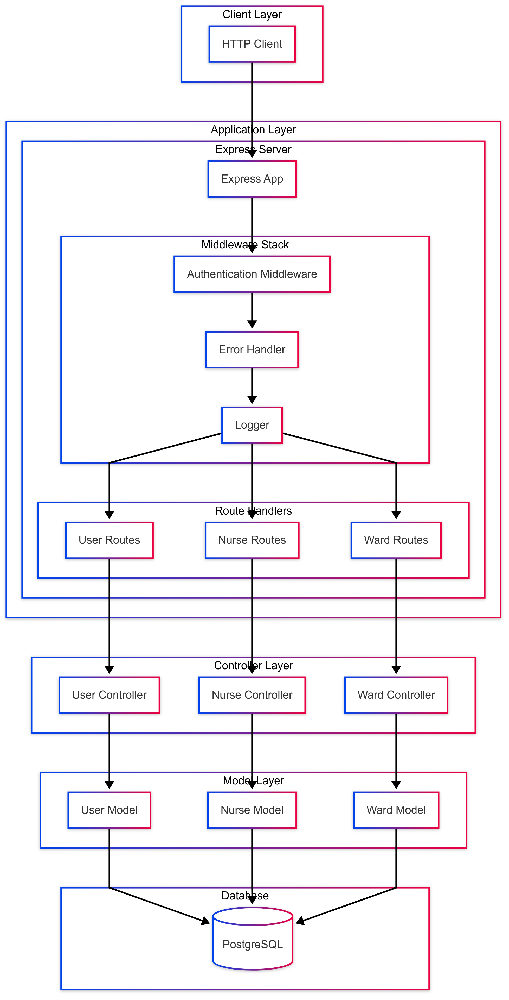
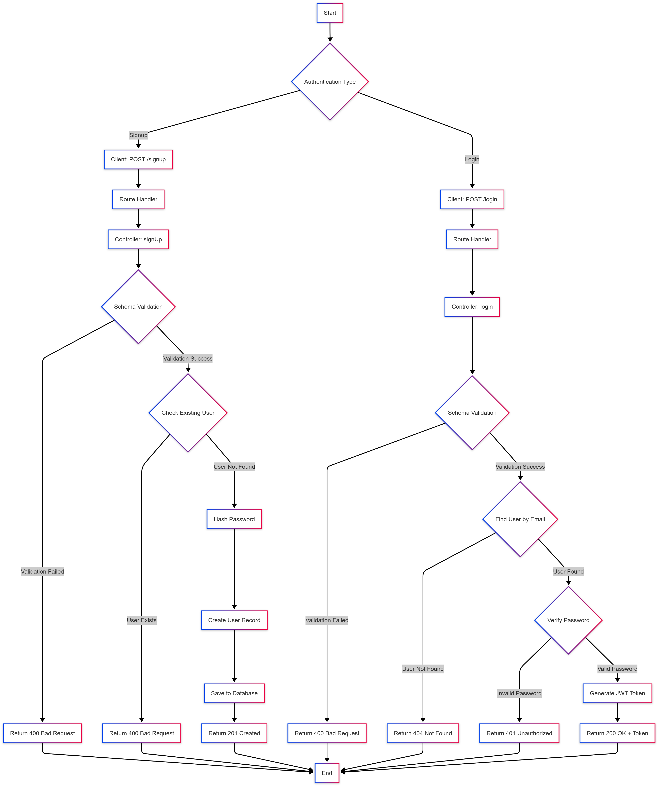
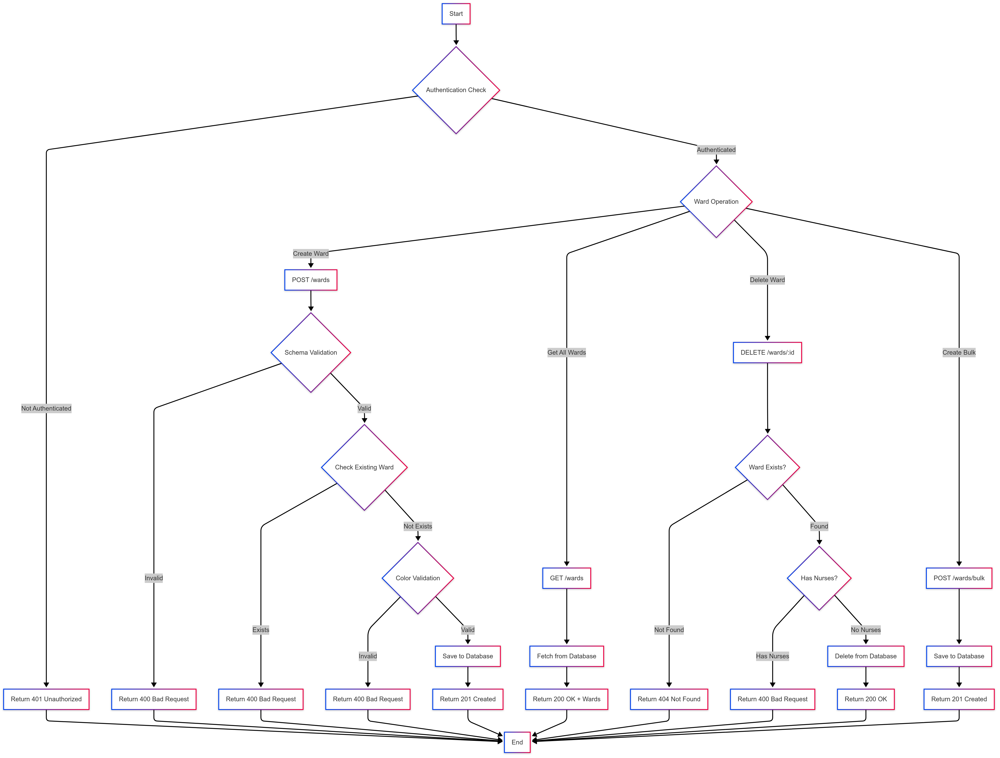
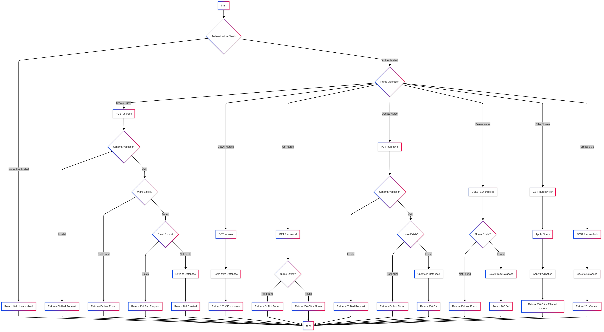

## Tech Stack

### Frontend
- React 19
- TypeScript
- Material-UI (MUI)
- React Bootstrap
- Vite
- React Router DOM

### Backend
- Node.js
- Express
- TypeScript
- PostgreSQL
- Sequelize ORM
- JWT Authentication
- Winston Logger
- Bcrypt
- Joi

## Prerequisites

- Node.js (v18 or higher)
- PostgreSQL
- npm or yarn package manager

## Getting Started

### Backend Setup

1. Navigate to the backend directory:
   cd Backend

2. Install dependencies:
   npm install

3. Create a `.env` file in the backend directory with the following variables:
   PORT=3000
   DB_HOST=localhost
   DB_USER=your_username
   DB_PASSWORD=your_password
   DB_NAME=nurse_management
   JWT_SECRET=your_jwt_secret

4. Start the development server:
   npm run dev

The backend server will start on `http://localhost:3000`

### Frontend Setup

1. Navigate to the frontend directory:
   cd Frontend

2. Install dependencies:
   npm install

3. Create a `.env` file in the frontend directory:
   VITE_API_URL=http://localhost:3000

4. Start the development server:
   npm run dev
  

The frontend application will start on `http://localhost:5173`

## Available Scripts

### Backend
- `npm run dev`: Start the development server with hot reload
- `npm run build`: Build the TypeScript code
- `npm start`: Start the production server

### Frontend
- `npm run dev`: Start the development server
- `npm run build`: Build the production version

## Project Structure

Nurse Management/
├── Backend/
│   ├── src/
│   │   ├── config/         # Configuration files (database etc.)
│   │   ├── controllers/    # Request handlers and business logic
│   │   ├── middleware/     # Custom middleware (auth, error, etc.)
│   │   ├── models/         # Database models and schemas
│   │   ├── routes/         # API route definitions
│   │   └── utils/          # Helper functions and utilities
│   ├── package.json        # Backend dependencies and scripts
│   └── tsconfig.json       # TypeScript configuration
├── Frontend/
│   ├── src/
│   │   ├── components/     # Reusable UI components
│   │   ├── pages/          # Page components and routes
│   │   ├── services/       # API service functions
│   │   └── utils/          # Helper functions and constants
│   ├── package.json        # Frontend dependencies and scripts
│   └── vite.config.ts      # Vite configuration
└── README.md

- This is the general architecture of the app.  
- Once the HTTP client makes a request, it reaches the application layer (Express app).  
- Through added middleware (e.g., logging incoming URLs, request bodies, and methods) or authentication middleware, the request is passed to the appropriate router.  
- Through the router, the data flows into the appropriate controller functions (based on the API endpoint).  
- Once the schema is validated, the data is saved into the database, and a response is sent back to the HTTP client. 

  
- This flowchart helps users sign up or sign in based on the API endpoint.

## For SignUp
- The body schema is validated. If validation fails, an error status is returned.
- After validation, a check is performed to see if the given email already exists.
- If the email does not exist, a new user is created, and the given password is hashed using a secret key.

## For SignIn
- The body schema is validated.
- After validation, a check is performed to see if the user already has an account with the given email.
- If no user is found, an error message is returned.
- If the user exists, the given password is validated against the hashed password.

---

  
- This flowchart helps users create or delete wards based on the schema.

## Route Details
- `GET /api/wards` - Retrieves the list of all wards.
- `POST /api/wards` - Creates a single ward.
- `DELETE /api/wards/:id` - Deletes a ward based on the given ID.
- `POST /api/wards/bulk` - Creates wards in bulk.

---

  
- This flowchart helps users create, read, update, or delete nurses based on the schema.

## Route Details
- `GET /api/nurses` - Retrieves the list of all nurses.
- `POST /api/nurses` - Creates a single nurse.
- `DELETE /api/nurses/:id` - Deletes a nurse based on the given ID.
- `POST /api/nurses/:id` - Updates a nurse based on the given ID.
- `GET /api/nurses/:id` - Retrieves a single nurse based on the given ID.
- `GET /api/nurses/?` - Filters nurses based on `fullName` and `wardName`.
- `POST /api/nurses/bulk` - Creates nurses in bulk.

